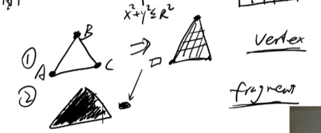

# 了解渲染管线vertex,fragment shader

## WebGL包括的语言
1. JavaScript: 用于在浏览器中编写WebGL应用程序的主要编程语言。
2. GLSL (OpenGL Shading Language): 用于编写顶点着色器和片段着色器的专用编程语言。

### GLSL
GLSL是一种类似于C语言的编程语言，专门用于编写运行在GPU上的着色器程序。它允许开发者直接控制图形渲染的各个阶段，从而实现复杂的视觉效果。
主要由两部分构成
1. 顶点着色器（Vertex Shader）: 处理每个顶点的数据，如位置、颜色、法线等。它负责将3D坐标转换为2D屏幕坐标。=》 字符串
2. 片段着色器（Fragment Shader）: 处理每个像素  =》字符串

简易理解：

  

## 渲染管线简介
渲染管线是图形渲染过程中一系列步骤的集合，用于将3D场景转换为2D图像。主要包括以下几个阶段：
1. **顶点处理（Vertex Processing）**: 处理顶点数据，包括变
换、光照计算等。顶点着色器在这一阶段运行。
2. **图元装配（Primitive Assembly）**: 将处理后的顶点组

