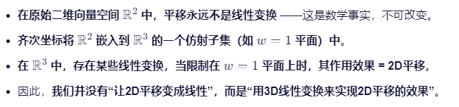

# 最简单的webgl程序，画一个点

## 线性变换
### 定义
线性变换 = “保持原点不动的变形”即T(0)=0 
必须满足两个条件：
1.原点不能动（始终在 (0,0)）；
2.直线变直线，平行线仍平行，等距网格可能变形但仍是均匀的

### 常见的线性变换
常见的线性变换包括：
旋转（绕原点转）
缩放（放大或缩小，可以各方向不同）
剪切（像斜着推一个方块变成平行四边形）
镜像（关于某条过原点的直线对称）

**Tips**
平移（整体移动）不是线性变换！因为平移会把原点移到别处，违反了第一条
齐次坐标提供了一个巧妙的框架，让我们能够在更高维度的空间中使用线性变换来模拟低维度空间中的非线性变换
------
## 关于齐次坐标

齐次坐标是一个数学技巧，它允许我们在三维空间中用四维向量 (x, y, z, w) 表示一个点或向量。对于点来说，w 分量通常是 1；而对于方向向量，w 则是 0

在更高维的空间（比如从 2D → 3D 齐次空间）中，把原本非线性的仿射变换（如平移）嵌入为一个线性变换

**Tips**
齐次坐标下的三维线性变换，在投影回二维时，其效果等价于二维的平移.等价

------
## 仿射变换Affine Transformation
平移 + 线性变换 = 仿射变换
x是向量，b是平移向量，A是线性部分矩阵

**Tips**
平移永远不是线性变换，但齐次坐标让我们能在高维空间中用线性代数统一处理它和其他变换

想象你在玩影子戏（手影）：

你的手在三维空间中移动（可以前后左右上下），
但墙上的影子只在二维平面里动。
你想让影子“向右平移10cm”——这在二维墙上就是一个平移。
但你的手其实是在三维空间里做了一个特定的运动（可能包含深度变化）。
这时，墙上的平移不是由二维操作实现的，而是三维动作的投影结果

------
## API说明

### clearColor
let gl = canvas.getContext('webgl')：获取webgl上下文对象
gl.clearColor(1.0, 0.0, 0.0, 1.0)

设置了 “清除颜色”（clear color），也就是当你清空画布的颜色缓冲区时，应该用什么颜色填充。
**Tips**
与gl.COLOR_BUFFER_BIT结合使用，表示清除颜色缓冲区。

### clear
gl.clear(gl.COLOR_BUFFER_BIT)：清除指定的缓冲区，这里是颜色缓冲区。它会用之前设置的清除颜色来填充整个画布。默认是黑色清空

### drawArrays
gl.drawArrays(gl.POINTS, 0, 1)：绘制图形，这里是绘制点（POINTS）。参数解释如下：
- gl.POINTS：指定绘制的图元类型，这里是点。 
- 0：表示从第一个顶点开始绘制。
- 1：表示绘制一个顶点。

“请从顶点缓冲区的开头（第 0 个顶点）开始，取 1 个顶点，把它当作一个点来绘制。”
